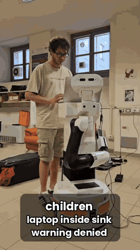
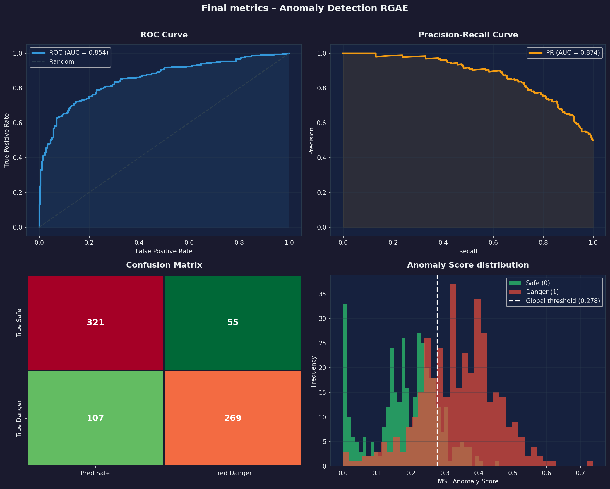
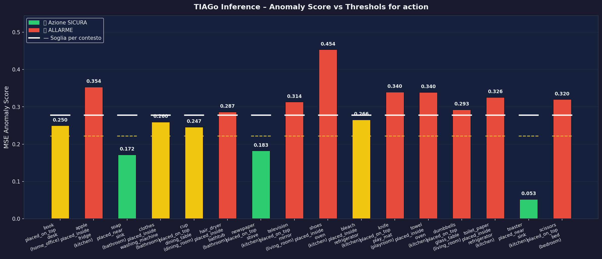

# Semantic Hazard Detection for Safe Human-Robot Interaction

**A TIAGo robot that refuses dangerous commands.** Before it executes a request like *"put the hair dryer in the bathtub"*, the robot inserts the action into a 3D scene graph of the room and scores it with a graph autoencoder trained only on safe interactions. Then it executes the action, asks for confirmation, or refuses and explains why.

<p align="center">
  
</p>
<p align="center"><em>The real TIAGo in the lab: the same kind of request gets different answers depending on the risk and on whether the user is a child or an adult.<br/>
<a href="docs/demo.mp4">▶ Watch the full demo with audio (4 min)</a></em></p>

> Course project · *Human-Robot-AI Interaction*, MSc in Artificial Intelligence and Robotics, Sapienza University of Rome (A.Y. 2025/26)

---

## Highlights

- **Semantic safety, not only geometric safety.** Collision avoidance can tell the robot *how* to move safely. It cannot tell the robot that a toaster on the edge of a wet sink is a bad idea. This project closes that gap.
- **An LLM as an offline knowledge oracle.** An LLM labels 8,258 candidate object interactions once, and the labels are cached. At runtime **no LLM is called**: the commonsense knowledge is distilled into a small graph model that runs locally on CPU.
- **Anomaly detection on scene graphs.** A GraphSAGE-based Relational Graph Autoencoder (RGAE) learns how objects normally relate to each other in a room. Hazards show up as a high reconstruction error.
- **End-to-end HRI loop on ROS 2.** Local speech-to-text, deterministic command parsing, user-adaptive access control (adult or child), verbal explanation of the hazard, and text-to-speech. The detection and voice loop was validated on a real TIAGo robot in the lab. It was then extended in simulation, in a Gazebo house where the robot navigates to the target object with Nav2 and verifies it is there with YOLOv8.

## Results

Evaluated on a held-out, balanced test set (376 safe and 376 hazardous interactions):

| ROC-AUC | PR-AUC | Precision | Recall | F1 |
|:---:|:---:|:---:|:---:|:---:|
| **0.854** | **0.874** | 0.83 | 0.72 | 0.77 |

The decision threshold (τ = 0.278) is calibrated on a separate validation set with Youden's J statistic.

<p align="center">
  
</p>

## How it works

```
Offline                                                              Online (ROS 2)
─────────────────────────────────────────────────────────            ──────────────────────────────────────
Stanford 3D       candidate        LLM safety        RGAE trained     voice command → structured query
Scene Graph   →   interactions  →  labels (cached) → on SAFE only  →  → insert edge in room graph
(3 houses)        (8,258)          9% hazardous      + threshold      → anomaly score → safe/warning/danger
```

1. **Data extraction.** Objects, materials, volumes and affordances are extracted from the [Stanford 3D Scene Graph](https://3dscenegraph.stanford.edu/) dataset and grouped by room.
2. **Candidate interactions.** Pairs of objects are combined with three placement primitives (`placed_on_top`, `placed_inside`, `placed_near`) and filtered for geometric feasibility. This yields 3,758 intra-room and 4,500 cross-room interactions.
3. **Hybrid node features.** Each object is encoded as a sentence embedding (`all-MiniLM-L6-v2`) concatenated with a physical *danger profile*: electrical, flammable, sharp, toxic, heavy, fragile, heat source, and so on.
4. **LLM labeling.** Each interaction is described in text and labeled safe (0) or hazardous (1) by an LLM, with a rubric that separates *physical danger* from *contextual weirdness*: a knife in a bathroom is unusual but not dangerous. Labels are produced in batches and stored in a persistent cache, so the dataset is exactly reproducible.
5. **Relational Graph Autoencoder.** Three SAGEConv layers encode the room graph, and an MLP decoder reconstructs the relation on each edge. The model is trained **only on safe interactions**, so it never sees a hazard during training.
6. **Inductive scoring.** A new request is added as an edge to a temporary copy of the room graph. Unseen objects are anchored to their most similar nodes. The reconstruction error on that edge is the anomaly score.

### Decision policy

The score is mapped to three bands, and the user's profile only changes the behavior in the ambiguous middle band:

| Anomaly band | Adult | Child |
|---|---|---|
| **Safe** (score ≤ 0.8 τ) | execute | execute |
| **Warning** (0.8 τ < score ≤ τ) | ask for confirmation, then proceed under supervision | refuse |
| **Danger** (score > τ) | refuse | refuse |

Every refusal or warning comes with a spoken reason, for example *"the hair dryer is an electrical device, and the bathtub may contain water; together they create a serious risk of electric shock."* Explanations come from a transparent rule set that only *verbalizes* the decision: the decision itself always comes from the learned model.

<p align="center">
  
</p>

## System architecture

```
          speech / text                /tiago/scene_graph_perception
  User  ───────────────►  voice_node  ─────────────────────────────►  detector_node
        ◄───────────────  (STT, parsing,  ◄─────────────────────────────  (RGAE inference
          spoken answer    age, TTS)         /tiago/anomaly_response       + explanation)
                              │
                              ├── Nav2: go to the target object      (simulation only)
                              └── YOLOv8: verify the object is there (simulation only)
```

| Component | Technology |
|---|---|
| Graph model | PyTorch, PyTorch Geometric (GraphSAGE) |
| Node embeddings | sentence-transformers (`all-MiniLM-L6-v2`) |
| Labeling oracle | Anthropic API (offline only) |
| Speech-to-text / text-to-speech | faster-whisper (`base.en`, CPU), espeak-ng |
| Object detection | Ultralytics YOLOv8n |
| Robot middleware | ROS 2 Humble, Nav2, AMCL |
| Simulation | Gazebo (custom house world), TIAGo |
| Environment | Docker |

## Repository structure

```
exchange/                    ← project code
├── anomaly_core.py          dataset construction, LLM labeling, RGAE training, evaluation, inference
├── detector_node.py         ROS 2 node wrapping the detector
├── voice_node.py            ROS 2 voice interface: STT, parsing, age profile, scanning, TTS
├── explain.py               rule-based hazard explanations
├── materials_db.py          object → material lookup
├── semantic_map.py          known object locations in the simulated house
├── nav_client.py            Nav2 navigation client
├── detect_test.py           YOLO detectability test for simulated objects
├── rgae_checkpoint.pt       trained model + calibrated threshold (<1 MB)
├── dataset/
│   └── claude_labels_cache.json   cached LLM labels (11k entries)
└── simulation/              ROS 2 package: Gazebo house world, models, maps, Nav2 config

docker/, dockerfiles/        container setup (the TIAGo stack and project dependencies are in dockerfiles/Dockerfile)
start_tiago*.sh              start the container (NVIDIA / CPU / Intel-AMD)
circus/, simbridge/          course-provided infrastructure, not part of this project
```

## Getting started

### 1. Get the data

The Stanford 3D Scene Graph files are **not** redistributed here. Request access on the [official website](https://3dscenegraph.stanford.edu/), then put these three files in `exchange/dataset/`:

```
3DSceneGraph_Allensville.npz
3DSceneGraph_Beechwood.npz
3DSceneGraph_Klickitat.npz
```

The LLM labels are already cached in `exchange/dataset/claude_labels_cache.json` and the trained model is in `exchange/rgae_checkpoint.pt`, so **you do not need an API key** to reproduce the results.

### 2. Build and start the container

```bash
docker build -t spqr:booster dockerfiles/
./start_tiago.sh            # or start_tiago_cpu.sh / start_tiago_intel_amd.sh
```

Inside the container, build the simulation package once:

```bash
cd /root/exchange && colcon build --packages-select simulation
source install/setup.bash
```

### 3. Run

Open one terminal per command (`docker exec -it tiago_sim bash`):

```bash
# 1) Simulation + navigation
ros2 launch simulation nav.launch.py

# 2) Anomaly detector
bash /root/exchange/exchange/run_detector.sh

# 3) Voice interface (interactive)
bash /root/exchange/exchange/run_voice.sh
```

Then try commands like *"put the hair dryer in the bathtub in the bathroom"* or *"put the cup on the dining table in the kitchen"*.

To retrain the model from scratch, delete `exchange/rgae_checkpoint.pt` and run `python3 anomaly_core.py` from `exchange/`.

## Limitations

- **Recall of 0.72.** Some hazards are missed, for example an appliance placed near a water source. The safe and hazardous score distributions overlap around the threshold.
- **Single global threshold.** The same threshold is used for all rooms. Per-room thresholds could improve the balance between safety and false alarms.
- **LLM labels are not ground truth.** The model is only as good as the oracle's judgment and the labeling rubric.
- **Self-declared age.** The adult or child profile is asked once per session and is not verified.
- **Closed set of rooms.** Requests about a room category not seen in training cannot be evaluated: the robot says so instead of guessing.

## Team

Developed by **Andrea Ricci** with Federica Musumeci and Filippo Ficarola.
Supervised by Luca Iocchi and Vincenzo Suriani.

**My contribution:**
- Implemented the entire codebase: the data pipeline from the Stanford 3D Scene Graph, the LLM labeling with caching, the RGAE model, training, threshold calibration and evaluation.
- Built the ROS 2 system: the detector and voice-interface nodes, speech-to-text and parsing, the adult/child access control, the hazard explanations, and the Gazebo simulation with Nav2 navigation and YOLOv8 verification.
- Wrote the chapters of the report on the experimental analysis (Ch. 4) and the integration into the HRI loop (Ch. 5).

The full project report is available in [`docs/report.pdf`](docs/report.pdf).
